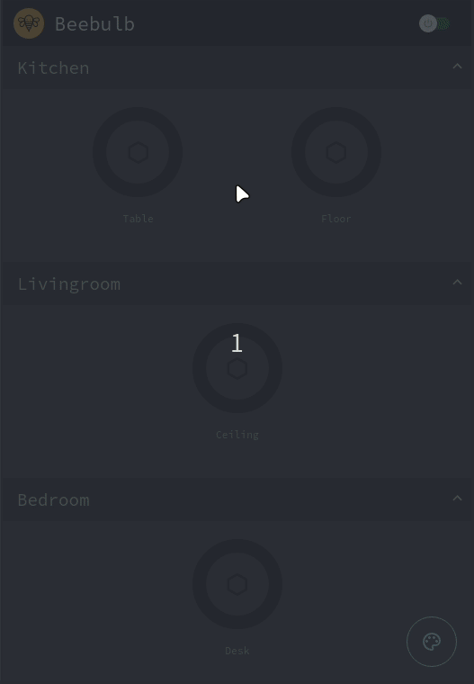

# Beebulb

  
Beebulb is a simple progressive web app used to control smart lights,
it leverages the deCONZ REST Plugin to manage and communicate with ZigBee-devices.  
Works on desktop and mobile.  
**Supported Devices**  
https://github.com/dresden-elektronik/deconz-rest-plugin/wiki/Supported-Devices

### Demo

https://github.com/vsvirins/Beebulb/blob/master/demo/DEMO.md

### Requirements

- ConBee / ConBee II / RaspBee and Raspberry Pi
- DeCONZ REST API
- Docker

### Installation

1. Install deCONZ rest Plugin.  
   Instructions: https://github.com/dresden-elektronik/deconz-rest-plugin
2. Install docker on your host computer or pi.  
   https://docs.docker.com/get-docker/
3. Clone this repo.  
   `$ git clone https://github.com/vsvirins/Beebulb`
4. Run the shell scripts found in beebulb/ and beebulb/user-api/ to build and run the containers.  
   Linux/Mac:  
   `$ bash start.sh`  
   Windows:  
   https://stackoverflow.com/questions/26522789/how-to-run-sh-on-windows-command-prompt/37478310#37478310
5. Confrim that it works:  
   http://localhost:8080

**PWA**, work in progress:

1. (Only tested with chrome) To install it on your desktop or mobile, go to your host's ip:8080 in chrome.
2. Press the three little dots in the top-right corner,  
   on desktop: hit 'Install Beebulb',  
   on mobile: 'Add to Homescreen'.

## License and credit

Coming.

**Disclamer**  
The app should work okay, but keep in mind that there are still some bugs lurking around and more configuration to be made with the networking in the docker containers. I'm on it!  
Also, any input is very much appreciated. Please feel free to send me pull requests.
