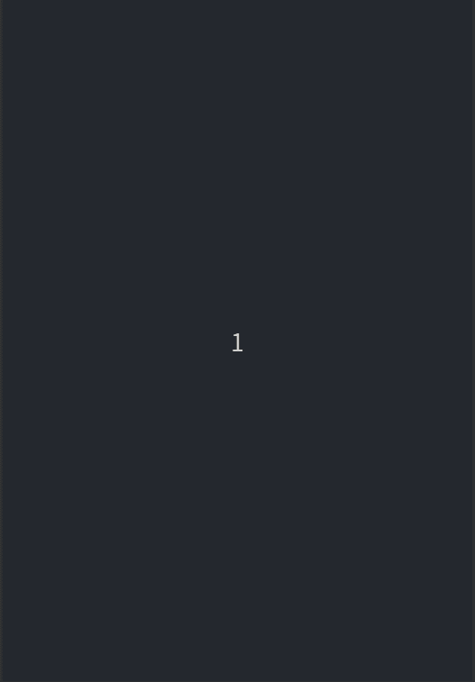
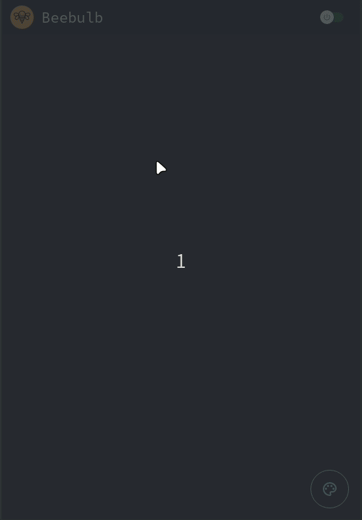
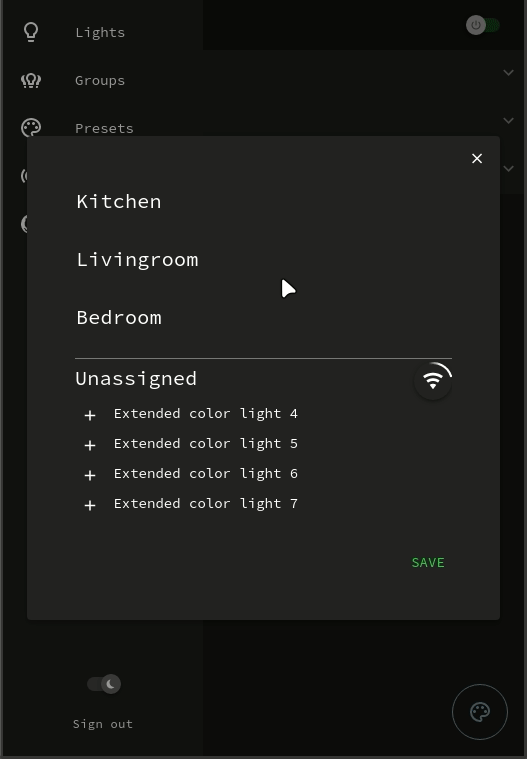
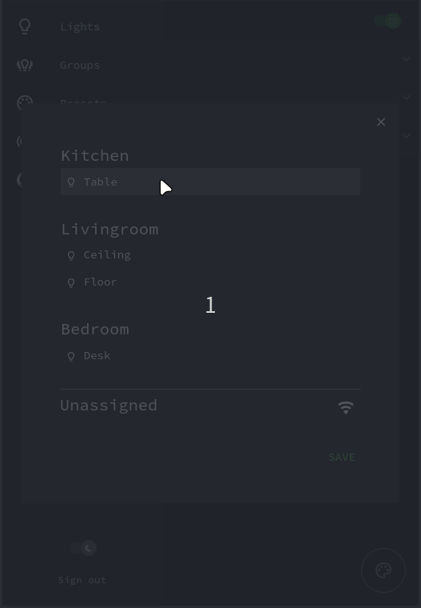
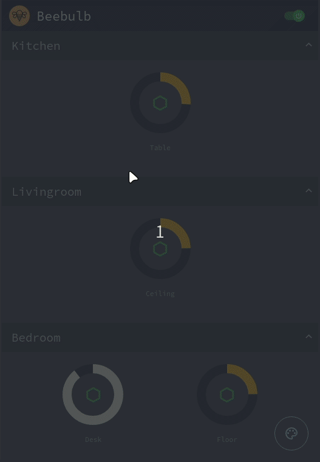
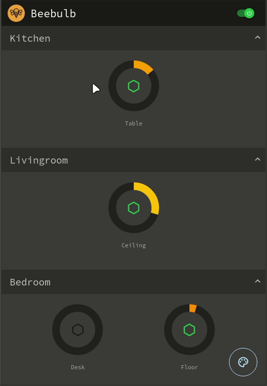
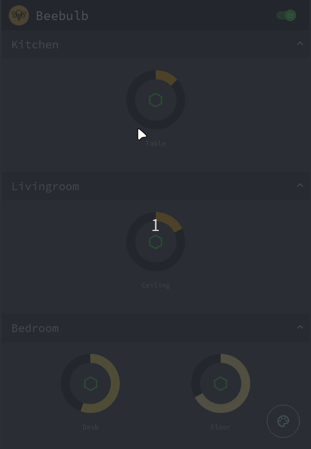
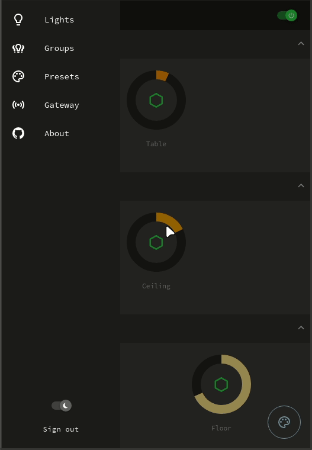

## Demo

#### Register a new user

#### Create your groups

#### Scan and assign your lights

###### Lights flash when they're selected.

#### Set the dim or turn all lights on/off

###### Lower dim gives warmer light.

#### Create and manage presets

###### Unqiue for each user.

#### Change the name of your gateway

#### Toggle between light and dark mode

